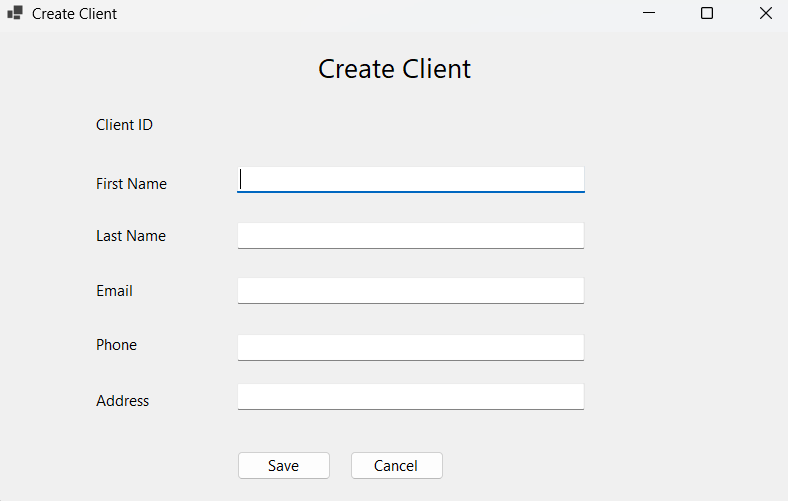
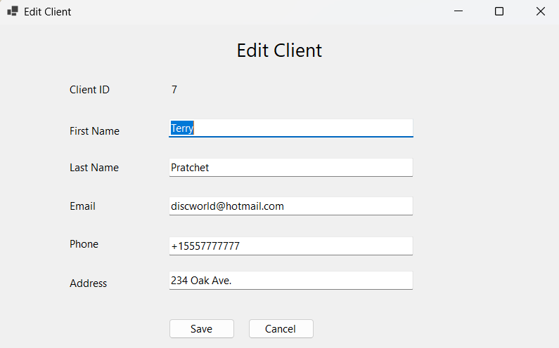
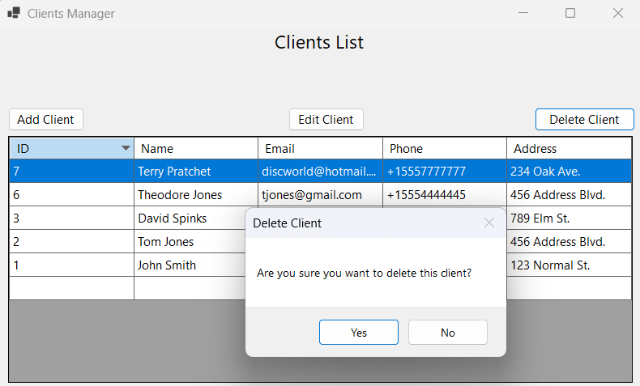

# Client-Manager
A desktop CRUD application built with C# and Windows Forms that allows users to manage client records stored in a MySQL database.

## Tech Stack
- C#
- .NET (WinForms)
- MySQL

## Features
- Uses a windows form to display all the records in a database
- Allows the user to add, edit, or delete a record in the database
- Shows records in descending order by id number (most recently added get displayed at the top)

## Skills Demonstrated
- Connecting to a database
- Designing a windows form
- Modular program design (different methods and classes to separate logic)
- Clear UI design

## How to Run
1. Clone or download this repository
2. Create a simple MySQL database with a table called client_table
3. Add the following columns to client_table (clientID, first_name, last_name, email, phone_number, address)
4. Make clientID AUTO_INCREMENT
5. Add your connection string for this database into the connectString variable in ClientRepository.cs
6. Build and run the project 

## Screenshots

### Main Window

### Add Client

### Edit Client

### Delete Client

